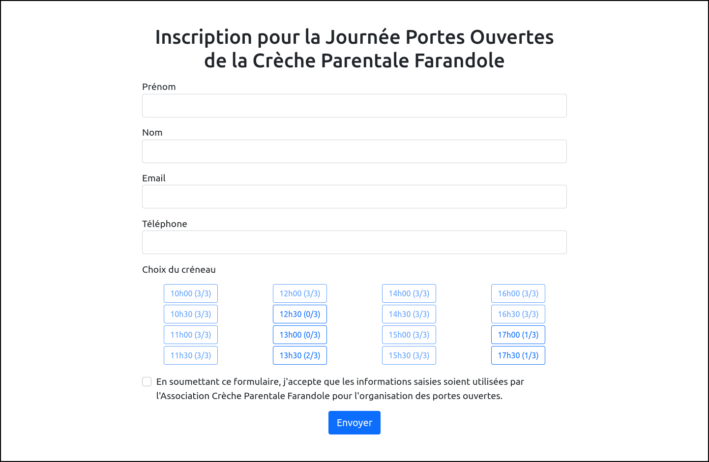
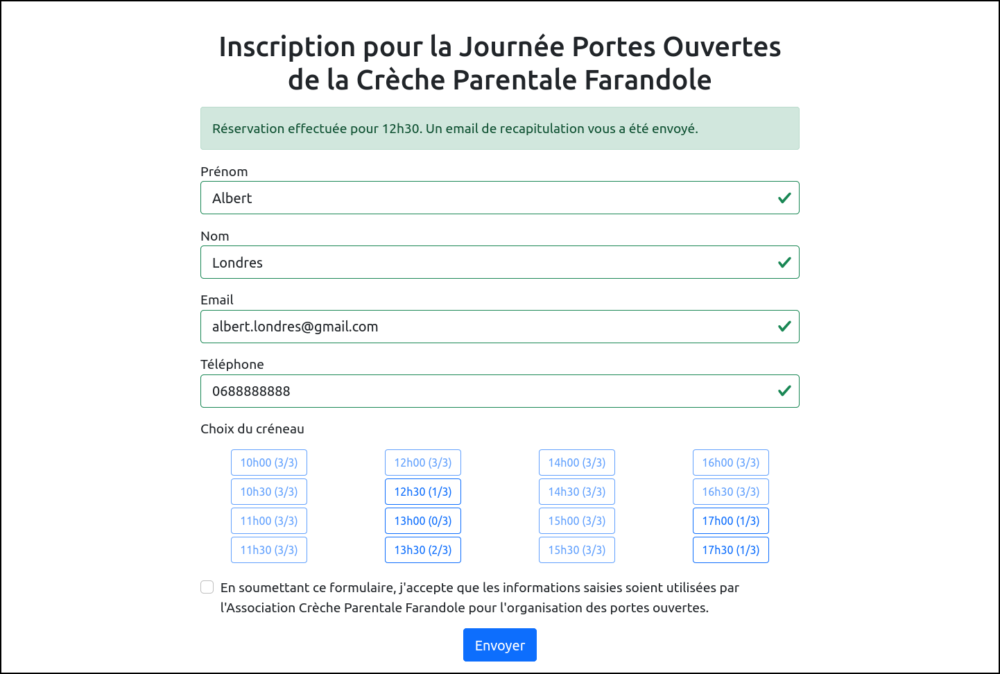
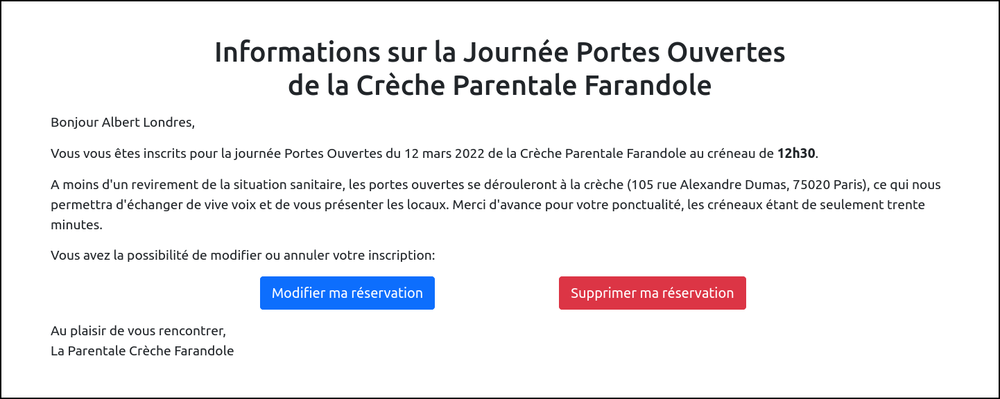
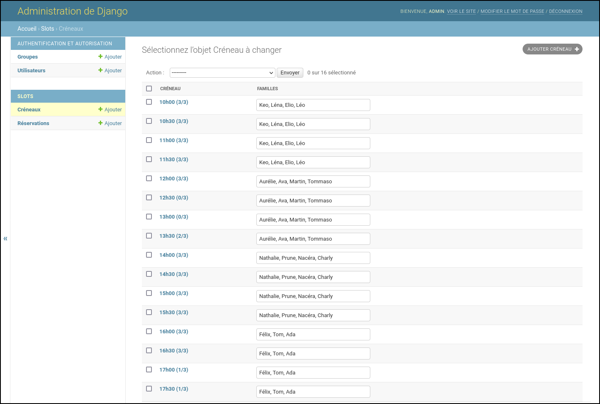

# Reservation for the open day of the Farandole parental daycare

Basic Django website allowing the online reservation for the open day of the [Farandole parental daycare](https://www.crechefarandole.com/).

Production version: https://reservation.crechefarandole.com/

Production version embedded in Wordpress: https://www.crechefarandole.com/jpo/

## Description

The Django app (under `slots`) and project (under `website`) consitute a basic reservation system to book slots to vist the [Farandole parental daycare](https://www.crechefarandole.com/) on the open day.

The client interface shows slots availability and allow to book a slot with basic information (Name, Email, Phone).
A confirmation of the booking is sent by email. In this email a private link allow to modify the booking or cancel it.

The admin interface allows managing slots and reservations.

## Configuration

A file `settings.json` has to be created at the root of the project with something like:

```json
{
    "SECRET_KEY": "supersecret",
    "EMAIL_HOST_PASSWORD": "supersecret",
    "UUID": "31f032a9-4890-42b3-8333-40611182f335",
    "DATE": "12-03-2022"
}
```
`SECRET_KEY` and `EMAIL_HOST_PASSWORD` corresponds to Django standard configuration. `UUID` is a random uuid which can be generated by `uuid.uuid4()`. `DATE` is the date of the open day.

Other configuration variables are defined in [<code>website/settings.py</code>](website/settings.py).

## Development

Local run for development is done using the standard Django procedure:

1. Create venv, load it and install required packages:

        python3 -m venv venv
        source venv/bin/activate
        pip install -r requirements.txt

2. Then, migrate and create super user:

        python manage.py makemigrations
        python manage.py migrate
        python manage.py createsuperuser

3. Finally, run the local development server:

        python manage.py runserver

## Production

For production, a standard procedure is suitable for this project.
For example on Ubuntu 20.04 with [Apache and mod_wsgi](https://docs.djangoproject.com/en/3.2/howto/deployment/wsgi/modwsgi/):

1. Install apache-wsgi and venv:

        sudo apt install libapache2-mod-wsgi-py3 python3-venv
    
    and certbot:

        sudo apt install certbot python3-certbot-apache
        
2. Create Apache configuration files in `/etc/apache2/sites-available/` using the examples [<code>farandole-reservation.conf</code>](farandole-reservation.conf) and [<code>farandole-reservation-redirect.conf</code>](farandole-reservation-redirect.conf)

3. Generate an SSL certificate:

        sudo certbot certonly --apache -d 'reservation.crechefarandole.com'

4. From current local directory transfer files to server:

        export HOST=ubuntu@reservation.crechefarandole.com
        rsync -azv --include-from=include.txt --exclude '*' --delete . $HOST:/home/ubuntu/reservation/

5. Create venv, load it and install required packages:

        cd /home/ubuntu/reservation/
        python3 -m venv venv
        source venv/bin/activate
        pip install -r requirements.txt

6. Then, migrate, collect static and create super user:

        python manage.py makemigrations
        python manage.py migrate
        python manage.py collectstatic --no-input -c -l
        python manage.py createsuperuser

7. Make database writable by user `www-data`:

        sudo chown www-data:www-data -R db
        sudo chmod ug=rwx,o= -R db

8. Enable Apache configurations and reload:

        sudo a2ensite farandole-reservation.conf farandole-reservation-redirect.conf
        sudo systemctl reload apache2

9. The admin interface should be accessible at: https://reservation.crechefarandole.com/admin/

10. Once everything work, set DEBUG to False for security reasons:

        sed -i 's/DEBUG = True/DEBUG = False/g' website/settings.py
        touch website/wsgi.py

10. To push local modifications (except the one requiring migrations) to server, use the script [<code>publish.sh</code>](publish.sh).

## Customization

Templates (forms, emails, ...) are located under [<code>slots/templates/slots/</code>](slots/templates/slots/) whereas base page templates are in [<code>website/templates/</code>](website/templates/).

## Screenshots

<p align="center">
    
    <em>Main interface allowing to only reserve available slots.</em>
</p>

<p align="center">
    
    <em>Confirmation on reservation.</em>
</p>

<p align="center">
    
    <em>Landing page to modify or cancel reservation from private link send by email.</em>
</p>

<p align="center">
    
    <em>Administration interface to manage slots.</em>
</p>

<p align="center">
    
    <em>Administration interface to manage reservations.</em>
</p>